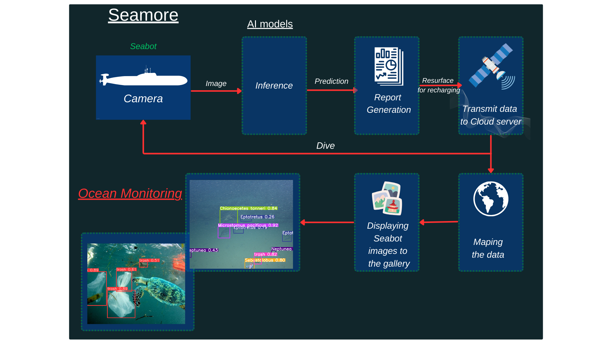
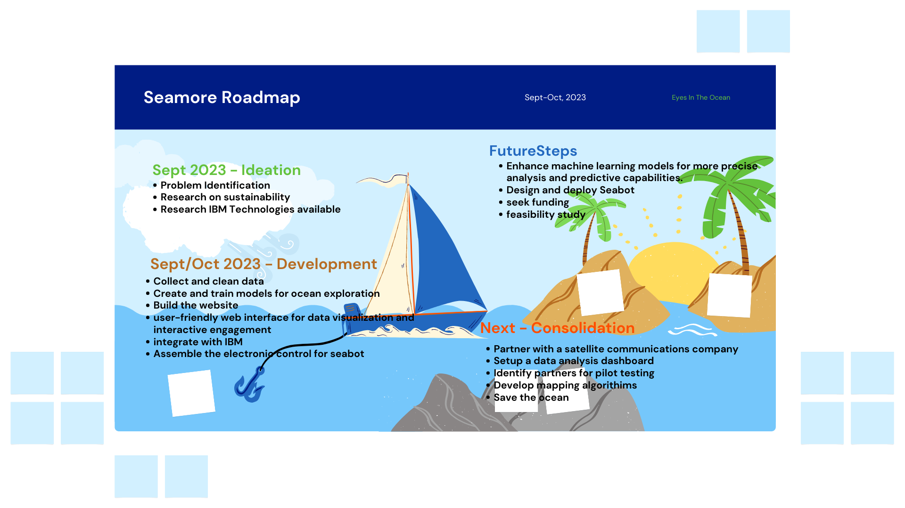

 

# Seamore

- [Project summary](#project-summary)
  - [The issue we are hoping to solve](#the-issue-we-are-hoping-to-solve)
  - [How our technology solution can help](#how-our-technology-solution-can-help)
  - [Our idea](#our-idea)
- [Technology implementation](#technology-implementation)
  - [IBM AI service(s) used](#ibm-ai-services-used)
  - [Other IBM technology used](#other-ibm-technology-used)
  - [Solution architecture](#solution-architecture)
- [Presentation materials](#presentation-materials)
  - [Solution demo video](#solution-demo-video)
  - [Project development roadmap](#project-development-roadmap)
- [Additional details](#additional-details)
  - [How to run the project](#how-to-run-the-project)
  - [Live demo](#live-demo)
- [About this template](#about-this-template)
  - [Authors](#authors)
  - [License](#license)
  - [Acknowledgments](#acknowledgments)

## Project summary

### The issue we are hoping to solve

Seamore aims to address the critical issue of rapidly deteriorating ocean health and biodiversity due to various factors such as climate change, overfishing, and pollution. By providing real-time data on marine species, ocean pollution, coral reef health, and other vital parameters, Seamore seeks to enable informed decision-making and foster sustainable practices to mitigate these challenges. Through its comprehensive approach to ocean exploration and conservation, Seamore endeavors to contribute significantly to the preservation and protection of marine ecosystems worldwide.

### How our technology solution can help

Seamore: Real-time ocean data for informed conservation and management.

### Our idea
What's Up with this water ????

Seamore was conceived in response to the escalating environmental challenges faced by our oceans, which are experiencing unprecedented stress due to climate change, overfishing, and pollution. These factors collectively threaten the delicate balance of marine ecosystems and jeopardize the biodiversity crucial to the sustenance of life on our planet. Recognizing the urgency of the situation, our team embarked on a mission to develop an integrated solution that would harness the power of advanced technology to monitor, analyze, and protect our oceans.

At the heart of Seamore are intelligent Machine Learning models built into a network of autonomous underwater vehicles called Seabots. These Seabots operate seamlessly, collecting a wide array of vital data, including information on ocean pollutants, marine biodiversity, coral reef health, and key oceanic parameters such as temperature and pH levels. The data collected by the Seabot network is then meticulously mapped onto a globe interface, ensuring accessibility for anyone seeking to understand and utilize this comprehensive and real-time information for the benefit of oceanic research and conservation efforts.

The existing methods of ocean monitoring and data collection often suffer from limitations such as human resource constraints, sporadic data acquisition, and insufficient coverage. Seamore represents a significant leap forward in addressing these challenges by offering a comprehensive and continuous approach to ocean observation and analysis. Unlike traditional techniques that rely on infrequent sampling, Seamore's real-time monitoring capabilities provide a continuous stream of data, enabling a more holistic understanding of the dynamic changes occurring in our oceans. By delivering accurate and timely information, Seamore empowers stakeholders, including researchers, policymakers, and environmental organizations, to proactively respond to emerging threats and implement effective strategies for marine ecosystem preservation.

Moreover, Seamore's integrated approach serves as a significant improvement over existing solutions by offering a multifaceted perspective on ocean health. By combining the detection of pollutants, monitoring of marine life, and assessment of coral reef health, Seamore provides a comprehensive overview of the various interrelated factors influencing the well-being of marine ecosystems. This holistic approach is crucial for developing targeted conservation measures, implementing sustainable fishing practices, and advocating for the protection of vulnerable marine species and habitats.

In essence, Seamore represents a pioneering technological solution that is poised to revolutionize the field of ocean exploration and conservation. By leveraging the capabilities of advanced robotics and data analytics, Seamore is dedicated to safeguarding the health and resilience of our oceans, ensuring the preservation of marine biodiversity for future generations. Through collaborative efforts and a shared commitment to environmental stewardship, Seamore aims to foster a global movement toward sustainable ocean management and a more secure future for our planet's most vital ecosystem.

More detail is available on our [website](https://www.seamore.earth/).

## Technology implementation

### IBM AI service(s) used

- IBM Watson Machine Learning - model inference (see inference server)

### Other IBM technology used

- IBM Cloud Object Storage - Computer vision models and data collected from the seabot network

### Solution Architecture

Diagram and a step-by-step description of the flow of our solution:

**Webpage Implementation**
1. The user navigates to the site and uploads an image file.
2. Our custom model processes the image and makes a prediction.

**Seabot Implementation**
1. Seamore's autonomous Seabots are deployed into the ocean, and they start collecting real-time data on various aspects.
2. The collected data is transmitted securely and efficiently to a centralized cloud server upon the seabots resurfacing for recharging.
3. The analyzed data is meticulously mapped onto an interactive global interface, providing a comprehensive view of the ocean's health and ecosystem dynamics.
4. Seamore's seabots continue to operate seamlessly, providing continuous and up-to-date data to facilitate ongoing monitoring and adaptation strategies.

## Presentation materials

### Solution demo video

### Project development roadmap

The project currently consists of 3 main components: our custom machine learning models, the AUV (seabot) electronic system, and the website where users can interact with the models and do the following things.

- Identify marine life
- Identify trash in the ocean
- analyzing the health of coral reefs 

In the future, we would like to:
- Improve our machine learning models to make them more accurate and efficient.
- Build a better mapping system to visualize and share Seamore data in a more informative and engaging way.
- Design and develop a more durable and affordable Seabot structure for mass production.
- Partner with a satellite communication company to enable data transfer to and fro the seabots
- Seek funding to support the continued development of Seamore, including the possibility of developing a solution to help recover trash from the ocean.
  
See below for our proposed schedule on the next steps after Call for Code 2023 submission.

## Additional details

### How to run the project

INSTRUCTIONS: In this section you add the instructions to run your project on your local machine for development and testing purposes. You can also add instructions on how to deploy the project in production.

### Live demo

You can find a running system to test at our [Website](https://www.seamore.earth/Solutions.html)

## About this template

### Authors
- Lewis Kamau Kimaru
- Sophia Musa
- Elly Kimutai

### License

This project is licensed under the Apache 2 License - see the [LICENSE](LICENSE) file for details.

### Acknowledgments

- Based on [Billie Thompson's README template](https://gist.github.com/PurpleBooth/109311bb0361f32d87a2).
